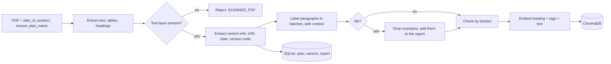
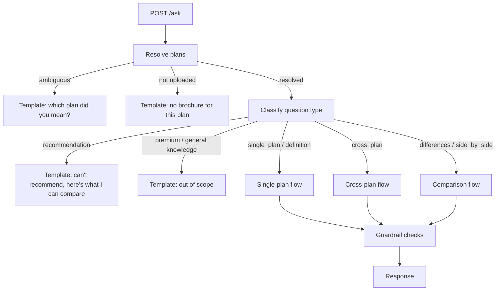

# Design: Insurance Plan RAG Query Engine (v1)

This document implements `requirements.md`. Requirement IDs are shown in brackets, for example [R3.4].

## 0. Summary of decisions
| Layer | Decision |
|---|---|
| 1. Core approach | Retrieval at question time only, with no stored fact sheets. Misses are reduced with query expansion, chunk tags, and intact table rows. Named-plan comparisons read each full brochure |
| 2. Ingestion | Separate health and life pipelines. Section labels use the previous paragraph as context, and act as a ranking boost. Life examples are dropped and listed. Version and date are auto-extracted |
| 3. Answering | Free text or selector input. Plans are resolved and confirmed. The flow depends on the question type. Misses get a page image plus 2 verbatim passages |
| 4. Guardrails | Prompt rules plus deterministic checks. One retry, then a refusal. Templated non-answers. The verifier slot is off in v1 |
| 5. Integration | A REST API that serves as the handoff contract. Expo prototype app. API-key security |
| 6. Stack | Python, FastAPI, PyMuPDF, bge-small, ChromaDB, SQLite. Models configured per role through an OpenAI-compatible client |

## 1. Core approach
Answers are produced at question time from brochure chunks. Nothing is pre-extracted into structured facts, because no reviewer is available to check them.

**Reducing retrieval misses:**
1. **Semantic search** with embeddings, which match meaning rather than exact words.
2. **Query expansion.** The labelling model rewrites the question into 3–5 phrasings that insurers use, backed by `config/glossary.yaml`, a synonym list you maintain (for example, room rent → accommodation, room category, single private room).
3. **Chunk tags.** At upload, each chunk gets standard-term tags. A wrong tag only affects whether the chunk is found; the answer is still written from the brochure's own text.
4. **Intact tables.** Each table row is kept with its column headers.

**When "not stated" can be said:**

| Path | What happens on a miss | Wording |
|---|---|---|
| Named-plan comparison | The full brochure is read | "Not stated in brochure" [R3.4] |
| Single-plan or cross-plan question | Search only | "Couldn't find this," plus the fallback [R3.5, R3.8] |

## 2. Ingestion


**2.1 Extraction** [R10.2]
- Use PyMuPDF `get_text("dict")` for text spans and their font sizes, and `page.find_tables()` for tables.
- A span is a heading if its font size is at least 1.15 × the page's median, OR it is bold and under 80 characters. The latest heading carries forward onto the paragraphs below it.
- Each table row becomes its own paragraph: `"<column header>: <cell>, …"`, with the table's title as its heading.
- Text that repeats on 60% or more of pages is treated as a header or footer and dropped, *after* version information has been read from it.
- If the average is under 200 characters per page, reject with `SCANNED_PDF`.

**2.2 Version information** [R4.3, R4.4]
- Regex patterns search for a UIN (`UIN[:\s-]*([A-Z0-9]{8,})`), dates (month-year and dd/mm/yyyy forms), and version codes (`V\d+|Version \d+`). These are usually found in footers and on the last page.
- Store `brochure_uin`, `brochure_date` and `brochure_version`, each of which may be null. Set `uploaded_at` to the current time.

**2.3 Labelling** [R2 context carried from the draft; R10.3]
- Batches: health 8 paragraphs, life 12. Each call includes the current heading and the previous paragraph's label and summary, then the numbered paragraphs. The model labels them in order, each one using the one before as context.
- The output per paragraph is JSON: `{idx, section, confidence, summary, tags[], is_example}`. The section is one of `eligibility`, `benefits`, `exclusions`, `insurer_highlights` or `other`.
- The JSON is validated in code. If it's invalid, retry once. If it fails again, label the paragraph `other` with `low` confidence and add a warning to the report.
- For life only, a regex pre-flag (`for example|let us understand|illustration|suppose|Mr\.|Mrs\.|aged \d+`) is passed to the model as a hint for `is_example`.

**2.4 Dropping examples** [R10.3]
- Paragraphs with `is_example = true` in life brochures are removed before chunking. Each one is listed in the upload report as `{page, preview}` and in the audit log.

**2.5 Chunking**
- Consecutive paragraphs with the same section are merged, up to a token limit (health 350, life 450). A chunk never spans two sections.
- The embedded text is `"[heading] | tags: … | body"`.
- Chunk metadata: `chunk_id`, `plan_id`, `product`, `insurer`, `plan_name`, `section`, `page_start`, `page_end`, `heading`, `tags`, `version_id`.

**2.6 Replacing a version** [R4.2]
- If the file hash is unchanged, return `unchanged`.
- Otherwise, write the new chunks under a new `version_id`, update `plans.current_version` in SQLite, and then delete the old chunks. Every query filters on `current_version`, so no answer ever mixes versions.
- The cleaned full text is also stored per version. It's needed for the full-brochure read in comparisons.

**2.7 Pipeline profiles**: `config/profiles.yaml`
```yaml
health: { max_chunk_tokens: 350, label_batch: 8,  drop_examples: false }
life:   { max_chunk_tokens: 450, label_batch: 12, drop_examples: true }
```

## 3. Answering


**3.1 Plan resolution** [R2]
1. If `plan_ids` are supplied, use them and ignore any plan names in the text.
2. Otherwise, the labelling model extracts plan mentions from the question. Each mention is matched against the uploaded catalogue by fuzzy matching (rapidfuzz), with a score of at least 90 required. If exactly one plan matches, it's resolved. If several match, return `clarification` with the options. If none match, return `no_brochure`.
3. Comparisons must be within one product. A mix of products returns the `cross_product` template [R1.5].

**3.2 Question type**: the labelling model assigns one of `single_plan`, `definition`, `cross_plan`, `differences`, `side_by_side`, `recommendation` or `out_of_scope`. Keyword rules run first, and the model is only called when no rule matches.

**3.3 Single-plan and definition flow** [R1.1, R7]
1. Expand the query, then search the plan's current chunks (top 8). The target section gets a score boost of +0.05; it is a boost, not a filter.
2. If the best score is below `MIN_RELEVANCE`, go to the miss flow (3.6).
3. Otherwise, the answering model gets the top chunks, numbered with their metadata, and writes a lead answer plus detail, citing each fact as `[n]`. If it replies `INSUFFICIENT`, go to the miss flow.

**3.4 Cross-plan flow** [R1.2, R5.1, R6.1]
1. The scope is the uploaded plans in the selected product (and insurer, if one was selected).
2. Run the expanded search for each plan in scope. Plans with a hit at or above `MIN_RELEVANCE` go to the answering model, which returns one line per plan, cited.
3. The response contains the scope statement, the plans where it was found (alphabetical), and the plans where it didn't turn up (alphabetical, each with its brochure link).

**3.5 Comparison flow** [R1.3, R1.4, R3.4, R3.9]
1. The rows are the product's default rows (`config/comparison_rows.yaml`) plus any rows the agent asked for.
2. For each plan: the answering model gets the plan's **full cleaned brochure text**, marked with page numbers, plus the row list. It returns `{row, quote, page}` or `{row, NOT_STATED}` for each row. The instruction is to quote the brochure's own wording, not paraphrase it.
3. For `differences`, one more small call marks each row `same` or `different`, based only on the quotes. The response shows the different rows first. No overall verdict is ever given.
4. If a brochure is too long for the model's context window, fall back to a per-row expanded search for that plan, and label its missing cells "couldn't find" instead of "not stated".

**3.6 Miss flow** [R3.8]
- A template message says the information couldn't be found.
- `page_image_url` points to the page of the best chunk found, so the app can show it.
- The next 2 chunks are returned verbatim with their pages, labelled "May not answer your question." Both are checked against the R6 rules first; any chunk that fails is skipped and the next one is tried.

**3.7 Response shape** [R2.5, R4.4, R8.1]
```json
{
  "type": "answer | comparison | cross_plan | not_found | clarification | declined",
  "answering_for": [{"plan_id": "...", "plan_name": "Optima Secure", "insurer": "HDFC ERGO"}],
  "lead": "PED waiting period is 3 years [1].",
  "detail": "…",
  "comparison": {"rows": [{"row": "Room rent", "cells": [{"plan_id": "...", "quote": "Single private AC room", "page": 3}]}]},
  "citations": [{"n": 1, "plan_id": "...", "page": 4, "section": "exclusions", "excerpt": "…"}],
  "related_passages": [{"plan_id": "...", "page": 5, "text": "…"}],
  "page_image_url": "/brochures/{plan_id}/pages/4.png",
  "sources": [{"plan_id": "...", "brochure_uin": "…", "brochure_date": "Mar 2026", "brochure_date_label": "Printed in brochure", "uploaded_at": "2026-09-12"}],
  "options": [],
  "request_id": "…"
}
```

## 4. Guardrails
**4.1 Prompt rules.** Answer only from the numbered context. Cite every fact. No premiums, rankings, claim promises, or general knowledge. Never phrase absence as exclusion. Reply `INSUFFICIENT` when the context doesn't answer the question.

**4.2 Deterministic checks.** These run on every generated answer, and on fallback passages:

| Check | Rule |
|---|---|
| Citations | Every sentence of `lead` and `detail` has a valid `[n]`; comparison cells have a page |
| Premium | Blocks ₹ or "Rs" amounts within 8 words of premium, cost, pay, instalment or illustration; also blocks "premium of" |
| Ranking | Blocks best, better, top, recommended, ideal, superior, "go with", "should choose" |
| Claim promises | Blocks "will be paid", "guaranteed claim", "claim will", "assured settlement" |
| Absence wording | Blocks "not covered" or "excluded" unless the cited chunk's section is `exclusions` |
| Cross-plan merge | In single-plan answers, blocks citations to more than one plan |

A failed check triggers one regeneration, with the failure reason added to the prompt. A second failure returns the relevant refusal template.

**4.3 Templates.** All non-answers live in `config/templates.yaml` [R3.11].

**4.4 Verifier slot.** A `Verifier` interface runs after the deterministic checks. `VERIFIER=none` in v1. A model-based verifier can be added later as one class plus a config change.

## 5. Integration
**5.1 API.** All endpoints require `X-API-Key`. Admin endpoints use a separate `ADMIN_API_KEY`.

| Method | Path | Purpose |
|---|---|---|
| GET | `/catalog/products` | Selector level 1 [R9] |
| GET | `/catalog/insurers?product=` | Selector level 2 |
| GET | `/catalog/plans?product=&insurer=` | Selector level 3 |
| POST | `/ask` | `{question, plan_ids?, product?, insurer?}` → response in §3.7 |
| GET | `/brochures/{plan_id}/pages/{n}.png` | Page image [R11] |
| GET | `/brochures/{plan_id}/file` | Full PDF |
| POST | `/admin/plans` | Upload or replace (multipart: file, plan_id, product, insurer, plan_name) → upload report |
| GET | `/admin/plans` | List plans with version info |
| DELETE | `/admin/plans/{plan_id}` | Delete a plan |
| GET/PUT | `/admin/comparison-rows/{product}` | Default rows [R10.4] |
| GET | `/health` | Liveness check |

The interactive `/docs` page is how you test the engine before the app exists, and it's the handoff contract [NFR7].

**5.2 Expo prototype** (built after the engine). Its screens:
- **Ask:** free text, plus a product → insurer → plan selector, with an "add plan to compare" option
- **Answer card:** lead, detail, citations, and sources
- **Comparison table:** plans side by side
- **Not-found card:** page image and related passages
- **Brochure viewer:** page images

During prototyping, the engine's Codespaces port is made public, and the app calls that URL.

## 6. Stack and configuration
| Piece | Choice |
|---|---|
| API | Python 3.11, FastAPI, Uvicorn |
| PDF | PyMuPDF (text, tables, page images) |
| Embeddings | `BAAI/bge-small-en-v1.5` via sentence-transformers, running locally |
| Vector store | ChromaDB, as local files |
| Catalogue, versions, audit log | SQLite |
| Fuzzy matching | rapidfuzz |
| Models | An OpenAI-compatible client, configured per role |

**Model roles** [NFR6]: each role has its own provider, model, base URL and key.
```
LABEL_BASE_URL=https://api.groq.com/openai/v1   LABEL_MODEL=<small>   LABEL_API_KEY=...
ANSWER_BASE_URL=https://api.groq.com/openai/v1  ANSWER_MODEL=<large>  ANSWER_API_KEY=...
```
- To point a role at the QA env, change its base URL, model and key.
- Nothing depends on provider-specific features. JSON is requested in the prompt and validated in code.
- Every call retries with backoff on 429 and 5xx errors.
- Prompts live in `app/prompts/*.txt`.
- Model candidates from the QA env are chosen by eval results, not picked in advance.

## 7. Repository layout
```
app/
  main.py  config.py
  api/        catalog.py ask.py brochures.py admin.py auth.py schemas.py
  ingestion/  extract.py version_info.py label.py chunk.py pipeline.py
  answering/  resolve.py qtype.py expand.py single.py cross.py compare.py miss.py
  guardrails/ checks.py templates.py verifier.py
  core/       llm.py embedder.py store.py db.py
  prompts/
config/  profiles.yaml glossary.yaml comparison_rows.yaml templates.yaml
eval/    golden/ labels/ run_eval.py
data/    (gitignored) pdfs/ chroma/ engine.db
tests/
mobile/  (Expo app, later)
```

## 8. Evaluation
- **Golden set:** `eval/golden/<plan_id>.yaml`. At least 10 questions per plan, covering every question type, plus unanswerable questions and ambiguous plan names.
- **`run_eval.py`** reports:
  - fact accuracy and citation correctness (judged offline by a model and spot-checked by you)
  - absence-wording violations
  - correct refusals
  - plan-resolution accuracy
  - latency percentiles
- The same harness runs per model configuration, so QA-env models are compared on the same numbers.

## 9. Risks
- **No runtime verifier.** Accuracy rests on retrieval, prompts, and the deterministic checks. The eval measures the gap; the verifier slot exists if it's needed.
- **Model context limits.** Full-brochure comparisons of life plans (around 10–15k tokens each) may exceed some QA-env models' context windows. The per-row fallback in §3.5 covers this, but produces weaker "couldn't find" cells.
- **Heading detection** varies across insurers. Monitor it through the upload reports.
- **Groq free-tier rate limits** during bulk uploads. Mitigated with backoff and throttling.